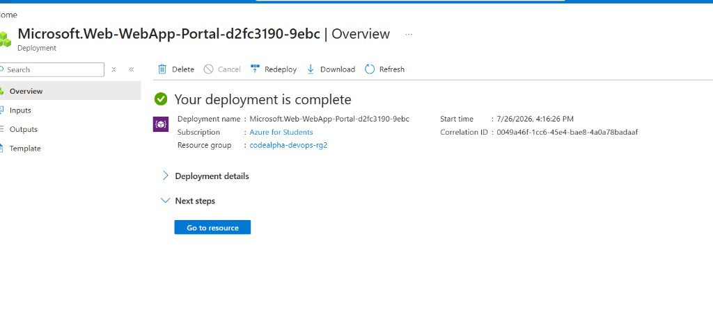
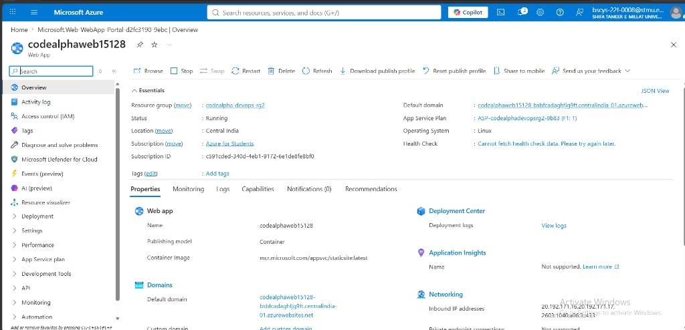

# Task 1 — Azure CI/CD Progress Log

**Intern:** Musfira Hassan  
**Domain:** DevOps · CodeAlpha  
**Subscription:** Azure for Students  

---

## Resources created

| Resource | Name | Details |
|----------|------|---------|
| Resource Group (ACR) | `codealpha-devops-rg` | Central India |
| Azure Container Registry | `codealphacr15128` | Login: `codealphacr15128.azurecr.io` · Admin enabled |
| Resource Group (Web App) | `codealpha-devops-rg2` | Used because B1 had no capacity in original RG |
| App Service Plan | `ASP-codealphadevopsrg2-9b83` | Linux · **Free F1** · Central India |
| Web App | `codealphaweb15128` | Status: **Running** · Publish: Container |
| Default URL | `https://codealphaweb15128-bsbfcadraghjg9ft.centralindia-01.azurewebsites.net` | Central India |

> Note: App Service **B1** failed in `codealpha-devops-rg` due to regional capacity. Creating a **new resource group** + **Free F1** succeeded (as suggested by Azure).

---

## Screenshot — Web App deployment complete

Azure Portal showed a successful deployment for the Web App in resource group `codealpha-devops-rg2`.



**Figure 1:** Deployment complete — Subscription: Azure for Students · Resource group: `codealpha-devops-rg2` · Start time: 7/26/2026, 4:16:26 PM.

## Screenshot — Web App overview (Running)



**Figure 2:** Web App `codealphaweb15128` — Running · Central India · Plan F1 · Container publish.

---

## Next steps

1. ~~Confirm Web App name and URL~~ ✅  
2. Create Azure DevOps project + pipeline  
3. Service connections: `acr-connection` + Azure Resource Manager  
4. Pipeline builds `task4-docker-webserver` → pushes to ACR → deploys to App Service  

> Note: Free **F1** may limit custom container pulls from ACR. If deploy fails, keep CI as build+push to ACR and upgrade plan to B1 when capacity is available.

---

## Pipeline variable values to use

```yaml
acrLoginServer: 'codealphacr15128.azurecr.io'
imageName: 'codealpha-webserver'
appServiceName: 'codealphaweb15128'
```
