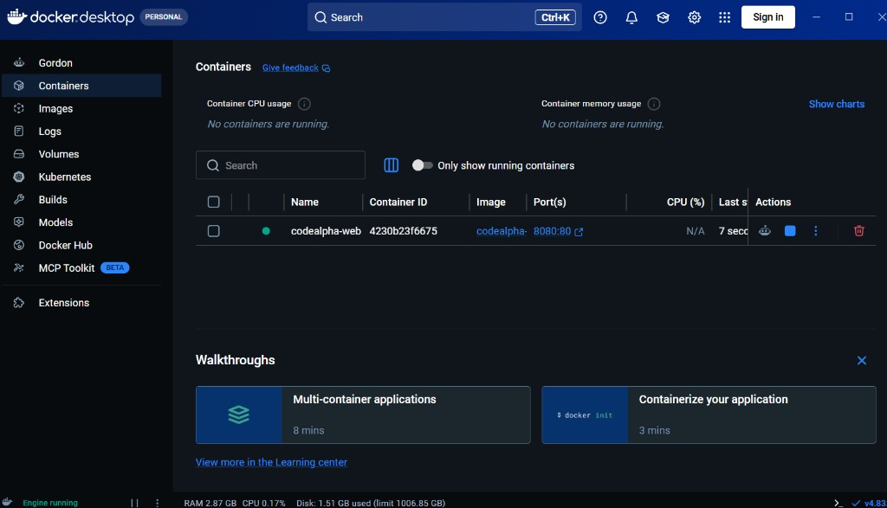

# Task 4 — Docker Web Server Progress

## Screenshot — Docker Desktop installed


**Figure 1:** Docker Desktop 4.83.0 installation succeeded on Windows.

## Screenshot — Virtualization not detected


**Figure 2:** Docker Desktop failed to start — virtualization support not detected (enable CPU virtualization / WSL2).

## Local Docker run (engine working)

After enabling WSL2, Docker Desktop started successfully.

Commands used:
```
docker build -t codealpha-webserver .
docker run -d --name codealpha-web -p 8080:80 codealpha-webserver
```

Result:
- Container `codealpha-web` running
- `http://localhost:8080` → HTTP 200
- `/health` → healthy

## Screenshot — Container running in Docker Desktop



**Figure 3:** Docker Desktop Containers — `codealpha-web` running, ports `8080:80`, Engine running.
