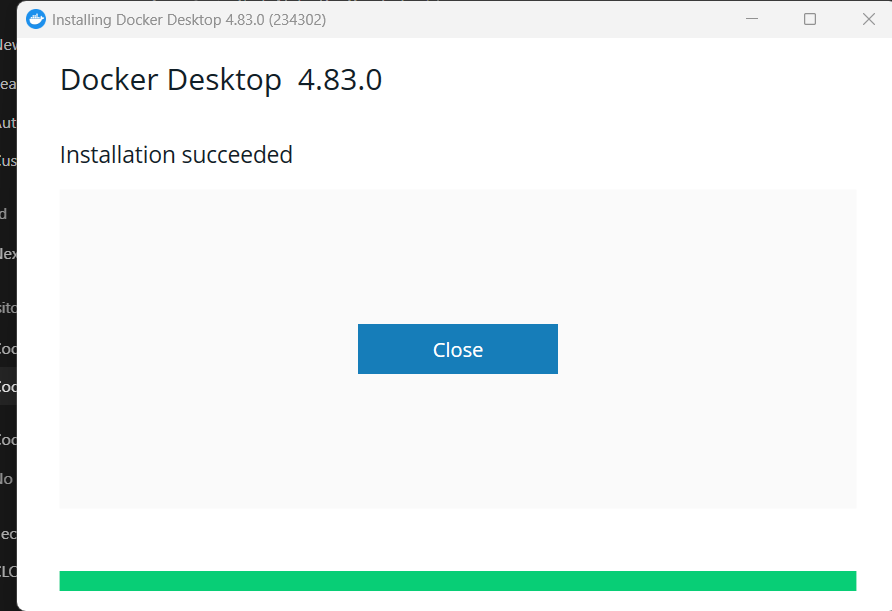
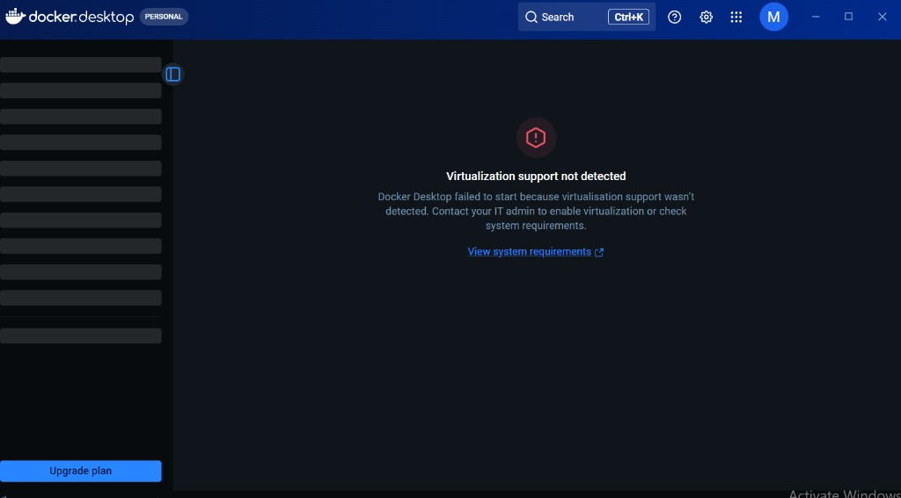

# Task 4 — Docker Web Server Progress

## Screenshot — Docker Desktop installed

**Figure 1:** Docker Desktop 4.83.0 installation succeeded on Windows.

## Screenshot — Virtualization not detected

**Figure 2:** Docker Desktop failed to start — virtualization support not detected (enable CPU virtualization / WSL2).
